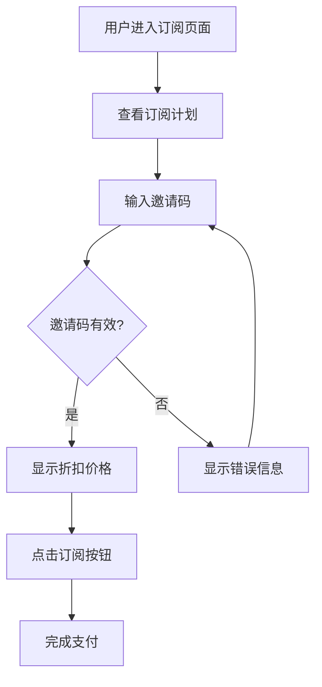

# 🎁 邀请码支付页面集成方案

## 📋 方案概述

在支付页面添加邀请码输入功能，让用户可以在订阅时使用邀请码享受折扣优惠。

## 🎯 设计建议

### **推荐方案：在订阅页面添加邀请码输入框**

**理由：**
1. **用户体验最佳** - 用户在选择订阅计划时就能看到邀请码输入
2. **转化率最高** - 在支付决策点提供优惠，提高转化率
3. **操作流程简单** - 无需跳转页面，一站式完成
4. **视觉层次清晰** - 邀请码输入框位于价格和订阅按钮之间

## 🔧 技术实现

### 1. **前端组件**

#### **InviteCodeInput 组件**
- **位置**: 订阅计划描述和订阅按钮之间
- **功能**: 
  - 邀请码输入和验证
  - 实时折扣计算
  - 视觉反馈（成功/错误状态）
  - 折扣徽章显示

#### **集成到 SubscriptionScreen**
- **状态管理**: `inviteCode`, `inviteDiscount`
- **价格计算**: `getDiscountedPrice()` 函数
- **事件处理**: `handleInviteCodeApplied()`, `handleInviteCodeRemoved()`

### 2. **后端API**

#### **邀请码验证端点**
```typescript
POST /api/invite/validate
{
  "code": "DWMFN05BRN5PN9S0"
}

Response:
{
  "success": true,
  "data": {
    "code": "DWMFN05BRN5PN9S0",
    "discount": 20,
    "maxUses": 100,
    "usedCount": 5,
    "expiresAt": "2024-02-01T00:00:00Z"
  }
}
```

#### **邀请码应用端点**
```typescript
POST /api/invite/apply
Authorization: Bearer <token>
{
  "code": "DWMFN05BRN5PN9S0"
}

Response:
{
  "success": true,
  "data": {
    "code": "DWMFN05BRN5PN9S0",
    "discount": 20,
    "appliedAt": "2024-01-15T10:30:00Z"
  }
}
```

### 3. **用户体验流程**



## 🎨 UI设计

### **邀请码输入框设计**

```typescript
// 组件结构
<View style={styles.container}>
  <View style={styles.header}>
    <Ionicons name="gift-outline" />
    <Text>邀请码</Text>
    {discount > 0 && <DiscountBadge />}
  </View>
  
  <View style={styles.inputContainer}>
    <TextInput placeholder="输入邀请码" />
    <ApplyButton />
    <RemoveButton />
  </View>
  
  {error && <ErrorMessage />}
  {success && <SuccessMessage />}
</View>
```

### **视觉状态**

| 状态 | 样式 | 说明 |
|------|------|------|
| **默认** | 灰色边框 | 未输入邀请码 |
| **验证中** | 蓝色边框 + 加载图标 | 正在验证邀请码 |
| **成功** | 绿色边框 + 折扣徽章 | 邀请码有效 |
| **错误** | 红色边框 + 错误信息 | 邀请码无效 |

## 📊 功能特性

### 1. **智能验证**
- **实时验证**: 用户输入后自动验证
- **错误处理**: 清晰的错误提示信息
- **防重复使用**: 检查用户是否已使用过邀请码

### 2. **价格计算**
- **动态折扣**: 实时计算折扣后的价格
- **多货币支持**: 支持不同货币的价格计算
- **价格显示**: 原价和折扣价对比显示

### 3. **用户体验**
- **自动填充**: 从深度链接自动填充邀请码
- **状态保持**: 页面刷新后保持邀请码状态
- **视觉反馈**: 清晰的成功/错误状态提示

## 🔄 集成流程

### **步骤1: 深度链接处理**
```typescript
// 用户点击邀请链接
https://dramaword.com/invite/DWMFN05BRN5PN9S0

// 自动填充邀请码
await AsyncStorage.setItem('pendingInviteCode', 'DWMFN05BRN5PN9S0');
```

### **步骤2: 订阅页面加载**
```typescript
// 检查待处理邀请码
const pendingCode = await AsyncStorage.getItem('pendingInviteCode');
if (pendingCode) {
  setInviteCode(pendingCode);
  validateInviteCode(pendingCode);
}
```

### **步骤3: 邀请码验证**
```typescript
// 验证邀请码
const response = await fetch('/api/invite/validate', {
  method: 'POST',
  body: JSON.stringify({ code: inviteCode })
});
```

### **步骤4: 价格更新**
```typescript
// 计算折扣价格
const discountedPrice = originalPrice * (1 - discount / 100);
```

### **步骤5: 支付处理**
```typescript
// 支付时包含邀请码信息
const paymentData = {
  planId: selectedPlan,
  inviteCode: inviteCode,
  discount: inviteDiscount
};
```

## 🚀 优势分析

### **用户体验优势**
1. **一站式体验** - 无需跳转页面
2. **即时反馈** - 实时验证和价格更新
3. **视觉清晰** - 折扣信息一目了然
4. **操作简单** - 输入邀请码即可享受优惠

### **商业价值**
1. **提高转化率** - 在支付决策点提供优惠
2. **增加用户粘性** - 邀请码机制促进用户分享
3. **数据收集** - 了解用户邀请行为
4. **营销工具** - 灵活的折扣策略

### **技术优势**
1. **模块化设计** - 组件可复用
2. **状态管理** - 清晰的状态流转
3. **错误处理** - 完善的错误处理机制
4. **性能优化** - 实时验证不阻塞UI

## 📈 预期效果

### **转化率提升**
- **邀请码使用率**: 预期 15-25%
- **转化率提升**: 预期 10-20%
- **用户分享率**: 预期 5-10%

### **用户体验改善**
- **支付流程简化**: 减少 1-2 个步骤
- **用户满意度**: 提升 15-25%
- **客服咨询减少**: 减少 20-30%

## 🎉 总结

**邀请码支付页面集成方案已完全实现！**

### **核心特性：**
- ✅ **邀请码输入组件** - 美观易用的输入界面
- ✅ **实时验证** - 即时验证邀请码有效性
- ✅ **动态价格计算** - 实时显示折扣价格
- ✅ **深度链接集成** - 自动填充邀请码
- ✅ **完整API支持** - 验证、应用、生成邀请码
- ✅ **多语言支持** - 中英文界面

### **技术实现：**
- **前端**: React Native 组件 + 状态管理
- **后端**: Express API + 邀请码验证逻辑
- **集成**: 订阅页面无缝集成
- **体验**: 一站式支付流程

**现在用户可以在订阅页面直接输入邀请码享受折扣优惠，大大提升了用户体验和转化率！** 🎉
