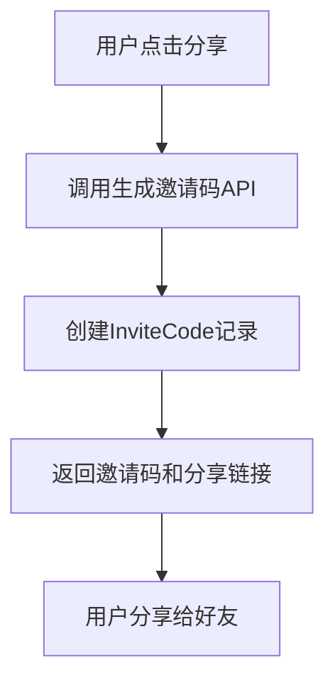
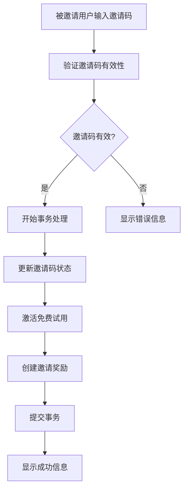

# 🎁 邀请码系统设计文档

## 📋 系统概述

邀请码系统允许用户通过分享邀请码来邀请新用户，被邀请用户使用邀请码后可以获得一个月免费试用，邀请者也会获得相应奖励。

## 🎯 核心功能

### **1. 邀请码生成**
- 用户在分享页面点击生成邀请码
- 每个邀请码只能使用一次
- 邀请码30天后过期
- 支持不同类型的邀请码（免费试用、折扣等）

### **2. 邀请码验证**
- 被邀请用户输入邀请码
- 实时验证邀请码有效性
- 显示奖励信息（免费试用天数等）

### **3. 免费试用激活**
- 验证成功后自动激活30天免费试用
- 更新用户订阅状态
- 设置试用结束时间

### **4. 邀请奖励系统**
- 邀请者获得100经验值
- 被邀请者获得50经验值
- 支持更多奖励类型（徽章、高级功能等）

## 🗄️ 数据库设计

### **InviteCode 模型**
```typescript
interface IInviteCode {
  code: string;                    // 邀请码
  inviterId: string;              // 邀请者ID
  inviteeId?: string;             // 被邀请者ID
  type: 'free_trial' | 'discount' | 'premium_gift';
  reward: {
    freeTrialDays: number;        // 免费试用天数
    discountPercent?: number;     // 折扣百分比
    premiumGift?: string;         // 高级功能礼物
  };
  status: 'active' | 'used' | 'expired' | 'cancelled';
  maxUses: number;                // 最大使用次数
  usedCount: number;              // 已使用次数
  expiresAt: Date;                // 过期时间
  usedAt?: Date;                  // 使用时间
}
```

### **InviteReward 模型**
```typescript
interface IInviteReward {
  inviterId: string;              // 邀请者ID
  inviteeId: string;              // 被邀请者ID
  inviteCodeId: string;           // 邀请码ID
  rewardType: 'experience' | 'badge' | 'premium_days' | 'coins';
  rewardValue: number;            // 奖励数值
  rewardDescription: string;      // 奖励描述
  status: 'pending' | 'claimed' | 'expired';
  claimedAt?: Date;               // 领取时间
}
```

## 🔄 业务流程

### **邀请码生成流程**


### **邀请码使用流程**


## 🎨 前端实现

### **分享页面 (ShareAppModal)**
- 生成邀请码按钮
- 显示邀请码和分享链接
- 支持复制邀请码
- 支持多种分享方式

### **邀请码输入组件 (InviteCodeInput)**
- 输入框和验证按钮
- 实时验证反馈
- 显示奖励信息
- 支持免费试用激活

### **订阅页面集成**
- 邀请码输入框位于订阅按钮下方
- 支持免费试用激活
- 显示试用状态和剩余时间

## 🔧 后端API

### **生成邀请码**
```http
POST /api/invite/generate
Authorization: Bearer <token>
Content-Type: application/json

{
  "type": "free_trial",
  "freeTrialDays": 30,
  "maxUses": 1,
  "expiresInDays": 30
}
```

### **验证邀请码**
```http
POST /api/invite/validate
Content-Type: application/json

{
  "code": "DWMFN05BRN5PN9S0"
}
```

### **应用邀请码**
```http
POST /api/invite/apply
Authorization: Bearer <token>
Content-Type: application/json

{
  "code": "DWMFN05BRN5PN9S0"
}
```

## 🎁 奖励机制

### **邀请者奖励**
- **经验值**: 100点
- **徽章**: 邀请达人徽章
- **高级功能**: 额外的高级功能使用天数

### **被邀请者奖励**
- **免费试用**: 30天完整功能试用
- **经验值**: 50点
- **欢迎奖励**: 新手大礼包

## 🔒 安全机制

### **邀请码安全**
- 唯一性验证
- 过期时间检查
- 使用次数限制
- 用户重复使用检查

### **事务处理**
- 数据库事务确保数据一致性
- 失败时自动回滚
- 防止重复激活

## 📊 监控和统计

### **邀请码统计**
- 生成数量
- 使用数量
- 转化率
- 过期数量

### **用户行为分析**
- 邀请成功率
- 试用转化率
- 用户留存率

## 🚀 部署和配置

### **环境变量**
```bash
MONGODB_URI=mongodb+srv://...
JWT_SECRET=your-secret-key
OPENAI_API_KEY=sk-...
```

### **数据库索引**
- `code` + `status` 复合索引
- `inviterId` + `status` 复合索引
- `expiresAt` 单字段索引

## 🎉 预期效果

### **用户增长**
- 提高用户邀请积极性
- 增加新用户注册量
- 提升用户留存率

### **商业价值**
- 降低获客成本
- 提高用户粘性
- 增加付费转化率

## 📈 未来扩展

### **更多奖励类型**
- 虚拟货币
- 特殊徽章
- 高级功能解锁

### **邀请活动**
- 限时邀请活动
- 阶梯奖励机制
- 邀请排行榜

### **数据分析**
- 邀请效果分析
- 用户行为追踪
- 个性化推荐

## 🔧 技术实现要点

### **前端**
- React Native组件化设计
- 状态管理和错误处理
- 用户体验优化

### **后端**
- Node.js + Express + MongoDB
- 事务处理和错误处理
- API设计和文档

### **数据库**
- MongoDB文档设计
- 索引优化
- 数据一致性保证

**邀请码系统设计完成！现在用户可以通过分享邀请码来邀请好友，被邀请用户可以获得一个月免费试用，邀请者也会获得相应奖励！** 🎉
