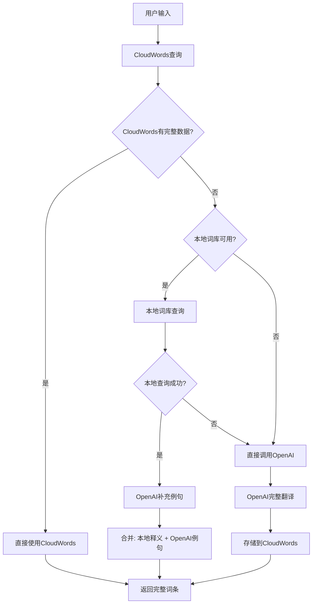

# 智能混合查询策略

## 🎯 核心思想

**离线词库释义 + OpenAI例句 = 完整词条**

## 📊 查询策略决策

### 1. **有本地词库时**
```
策略: local_first
- ✅ 使用本地词库获取释义
- ✅ 调用OpenAI补充例句
- ❌ 不存储到CloudWords (避免重复)
- 🎯 结果: 本地释义 + OpenAI例句
```

### 2. **无本地词库时**
```
策略: openai_first  
- ✅ 直接调用OpenAI完整翻译并存储到CloudWords
- ✅ 存储到CloudWords (完整词条)
- 🎯 结果: OpenAI完整翻译 + 例句
```

## 🔄 优化后的查询流程



## 🗄️ CloudWords优化策略

### 查询优先级
1. **CloudWords优先**: 先查询CloudWords中是否有完整数据
2. **本地词库**: 如果CloudWords无数据，查询本地词库
3. **OpenAI直接**: 如果本地词库无数据，直接调用OpenAI
4. **OpenAI补充**: 根据需要调用OpenAI补充例句或完整翻译

### 存储时机
- **不存储**: 当CloudWords已有完整数据时
- **不存储**: 当本地词库有释义时
- **存储**: 当直接调用OpenAI时

### 存储内容
```json
{
  "word": "こんにちは",
  "correctedWord": "hello", 
  "translation": "hello",
  "definitions": [{
    "definition": "hello",
    "partOfSpeech": "interjection",
    "examples": ["こんにちは、元気ですか？"]
  }],
  "phonetic": "konnichiwa",
  "kana": "こんにちは",
  "romaji": "konnichiwa",
  "translationSource": "openai"
}
```

## 🌐 多语言释义支持

### 界面语言匹配
- **EN界面** → 英文释义
- **ZH界面** → 中文释义

### 示例
```
输入: "こんにちは"
EN界面结果: "hello" (英文释义)
ZH界面结果: "你好" (中文释义)
```

## 🚀 性能优化

### 1. **离线优先**
- 本地词库查询速度最快
- 减少网络请求

### 2. **智能缓存**
- CloudWords避免重复查询
- 本地词库持久化存储

### 3. **按需加载**
- 只在需要时调用OpenAI
- 避免不必要的API调用

## 📈 查询统计

```typescript
interface QueryStats {
  localDictionaryAvailable: boolean;
  onlineTranslationAvailable: boolean;
  totalLocalEntries: number;
  storageSize: number;
}
```

## 🔧 配置选项

```typescript
interface HybridQueryOptions {
  enableLocalDictionary: boolean;
  enableOnlineTranslation: boolean;
  localFirst: boolean;
  maxCandidates: number;
  minConfidence: number;
}
```

## 🎯 最佳实践

1. **优先使用本地词库** - 速度快，离线可用
2. **OpenAI补充例句** - 丰富词条内容
3. **智能存储策略** - 避免重复存储
4. **多语言支持** - 根据界面语言选择释义
5. **性能监控** - 跟踪查询统计和性能

## 🔮 未来扩展

- [ ] 词库自动更新
- [ ] 用户偏好设置
- [ ] 查询结果缓存
- [ ] 更多语言支持
- [ ] 机器学习优化
